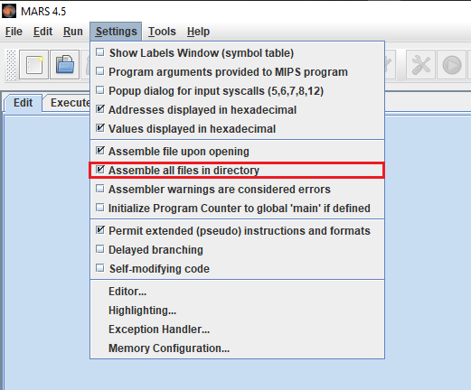

# T1 - Organização e Arquitetura de Computadores 
Primeiro trabalho prático para a disciplina de Organização e Arquitetura de Computadores (2021).

## Objetivos
1. Ler, da entrada padrão, três informações:
* Um caractere, de valor 'B', 'D' ou 'H', representando a base do número a ser informado: binário, decimal ou hexadecimal respectivamente;
* Um inteiro, se a base for decimal, ou uma "string", se ela for binária ou hexadecimal;
* Um segundo caractere, semelhante ao primeiro, porém indicando a base do número de saída do programa.

2. Tratar exceções associadas ao programa implementado, como valores digitados inválidos ou um número de entrada que não seja positivo.

3. Imprimir, na saída padrão, o número de entrada convertido para a base informado na forma de inteiro ou string. O output terá 32B se a base for binária, ou 8B, se ela for hexadecimal.

## Metodologia

Quatro funções: a principal (main); uma de conversão de uma "string", em binário, para um valor inteiro; uma de conversão de uma "string", em hexadecimal, para um valor inteiro; uma de conversão de um decimal para uma impressão em quaisquer das outras duas bases.

## Compilação

O programa utilizado para compilação fora o [Mars 4.5](https://courses.missouristate.edu/KenVollmar/MARS/). Para compilar todos os arquivos de extensão "asm" em um diretório, basta aplicar a configuração correspondente como mostrado na figura a seguir: 

